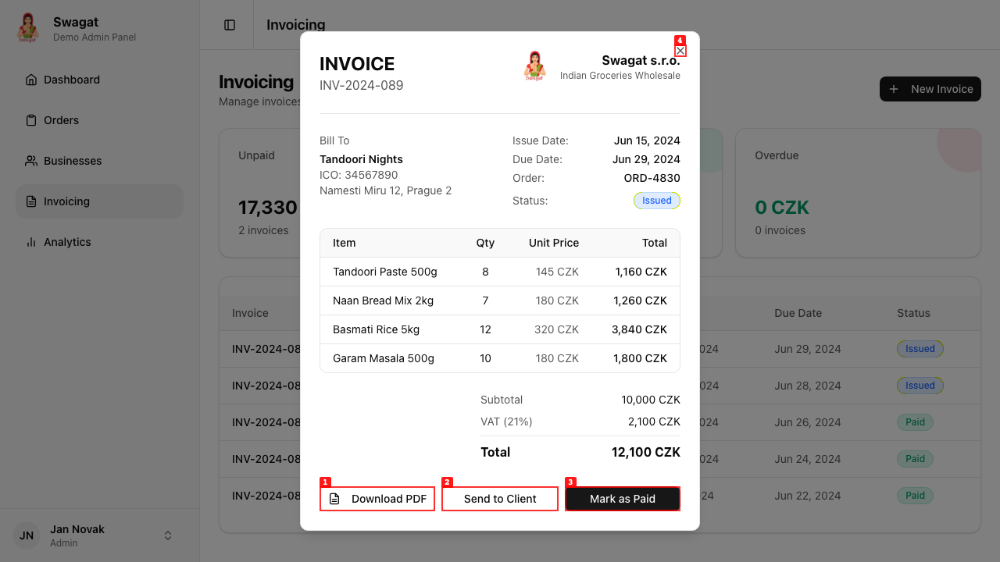

# Dogfood Report: Swagat Admin Dashboard

| Field | Value |
|-------|-------|
| **Date** | 2026-02-28 |
| **App URL** | https://dashboard-app-sigma-jet.vercel.app |
| **Session** | swagat-dogfood |
| **Scope** | Full application exploratory testing |

## Summary

| Severity | Count |
|----------|-------|
| Critical | 0 |
| High | 0 |
| Medium | 1 |
| Low | 0 |
| **Total** | **1** |

## Issues

### ISSUE-001: Missing Dialog Accessibility Labels

| Field | Value |
|-------|-------|
| **Severity** | medium |
| **Category** | accessibility / console |
| **URL** | All pages with dialogs (Orders, Businesses, Invoicing) |
| **Repro Video** | N/A |

**Description**

Console warnings indicate that `DialogContent` components are missing required `DialogTitle` elements for screen reader accessibility. This affects all modal dialogs in the application including:
- Order detail popup
- Business detail popup
- Add Business form
- Invoice preview popup
- New Invoice form

The warnings are:
- `DialogContent requires a DialogTitle for the component to be accessible for screen reader users`
- `Warning: Missing Description or aria-describedby={undefined} for {DialogContent}`

**Repro Steps**

1. Open any page with a dialog (Orders, Businesses, Invoicing)
2. Click on a table row or action button to open a dialog
3. Open browser developer tools (F12) and check Console tab
4. **Observe:** Accessibility warnings appear in console

---

## Tested Functionality (Working)

All other tested functionality worked as expected:

| Feature | Status |
|---------|--------|
| Dashboard page loads | Pass |
| Sidebar navigation | Pass |
| Profile dropdown menu | Pass |
| Settings navigation | Pass |
| Settings page forms | Pass |
| Orders page with filters | Pass |
| Order detail popup | Pass |
| Businesses page | Pass |
| Add Business dialog | Pass |
| Business detail popup | Pass |
| Invoicing page | Pass |
| Invoice preview popup | Pass |
| New Invoice dialog | Pass |
| Analytics page with charts | Pass |
| "View all" navigation buttons | Pass |
| Responsive chart rendering | Pass |
| Avatar colors per business | Pass |
| Activity dots with colors | Pass |

## Screenshots Captured

- `dashboard-check.png` - Main dashboard view
- `profile-dropdown.png` - Profile menu expanded
- `settings-page.png` - Settings page
- `settings-scrolled.png` - Settings page scrolled
- `analytics-page.png` - Analytics with charts
- `analytics-scrolled.png` - Analytics bottom section
- `view-all-orders.png` - Orders page via View all
- `view-all-businesses.png` - Businesses page via View all
- `invoice-popup.png` - Invoice preview dialog
- `new-invoice-dialog.png` - Create invoice form
